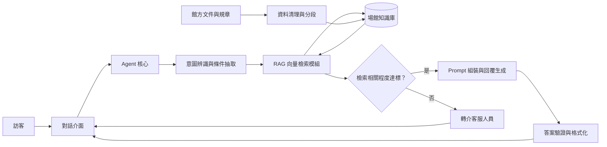

# 藝文展館通用型智慧客服 Agent

本專案為大學「AI Agent 實作」課程的專案成果，主題為「智慧產品客服 Agent 的初步構想與使用場景」。專案聚焦於建構一個可複製、可擴充且易於維護的藝文展館通用型智慧客服 Agent，並以桃園橫山書法藝術館（Hengshan Calligraphy Art Center）作為首發落地驗證場景（Pilot Case）。

系統預計採用檢索增強生成（Retrieval-Augmented Generation, RAG）架構。館方未來只需更新專屬問答文件、展覽資料或參觀規章，Agent 即可透過知識庫檢索最新內容並生成回覆，無須因應一般內容異動而重新訓練模型。

## 專案概覽（Project Overview）

### 專案定位

本專案不是單一場館的固定問答機器人，而是一套以「場館知識庫可替換」為核心設計的客服 Agent。系統將共通的對話能力、意圖理解與回覆規則，和各場館的營運資料分離，使同一套架構能夠平移至博物館、美術館、文化館舍及其他藝文展館。

### Pilot Case：桃園橫山書法藝術館

桃園橫山書法藝術館作為初期驗證對象，具有建築、書法藝術、展覽活動與公共服務等多元資訊。Agent 將協助訪客快速取得參觀所需資訊，也能作為驗證 RAG 知識更新、Prompt 設計與結構化回覆的實作場域。

### 專案目標

- 建立能理解自然語言問題並提供具脈絡回覆的藝文展館客服 Agent。
- 將場館資料整理為可檢索、可更新、可追蹤來源的知識庫。
- 透過 RAG 降低模型產生錯誤或過時資訊的風險。
- 以模組化方式拆分 Agent、檢索模組與對話介面，方便後續替換技術或擴充場館。
- 透過可量化的測試案例評估回答正確性、完整性、相關性與穩定性。

## 現行痛點與設計目標（Problem Statement & Objectives）

### 現行痛點

藝文展館的資訊通常分散於官方網站、社群貼文、活動頁面、公告文件與現場規章，訪客在查詢時可能遇到以下問題：

- 票價、預約、退換票與參觀規範分散在不同頁面，查找成本高。
- 展覽檔期與活動報名資訊會持續更新，靜態 FAQ 容易過時。
- 交通、停車、無障礙動線等問題具有情境差異，單一固定答案不一定適用。
- 館舍特色與作品資訊需要兼顧正確性、可讀性及導覽價值。
- 尖峰時段大量重複提問會增加服務人員的回覆負擔。

### 設計目標

| 目標 | 設計方向 |
| --- | --- |
| 資訊正確 | 優先根據知識庫內容回答，無足夠依據時明確說明限制，不臆測館方資訊。 |
| 資訊即時 | 將易變動的票務、活動與營運資料獨立管理，支援快速更新與重新索引。 |
| 對話自然 | 以訪客的日常語言理解問題，必要時主動確認日期、身分、交通方式等條件。 |
| 回覆可用 | 以條列、步驟、日期與注意事項整理答案，降低訪客閱讀與執行成本。 |
| 架構可擴充 | 將共通 Agent 能力與各館專屬知識分離，支援跨場館移植。 |
| 結果可評估 | 建立標準測試題集與評估指標，持續檢驗模型與 Prompt 的品質。 |

## 系統架構概念

系統由對話介面、Agent 核心與 RAG 向量檢索模組組成。使用者提出問題後，Agent 先判斷意圖與必要條件，再從場館知識庫取得相關內容，最後依據檢索結果與回覆規範生成答案。



### 主要模組

#### 1. Agent 核心

- 解析訪客問題，判斷票務、交通、活動、導覽或參觀須知等意圖。
- 根據問題情境提出必要的追問，例如參觀日期、票種、人數或交通方式。
- 控制工具呼叫與知識檢索流程，避免直接依賴模型記憶回答易變動資訊。
- 遵循回覆語氣、引用依據、未知問題處理與人工服務轉介規則。

#### 2. RAG 向量檢索模組

- 將館方 FAQ、公告、展覽資訊、交通說明與規章資料清理、分段並建立向量索引。
- 根據訪客問題進行語意檢索，取得最相關的文件片段。
- 將檢索結果與來源資訊提供給 Agent，作為回答的依據。
- 支援文件更新、版本管理與重新索引，讓知識庫內容可持續維護。

#### 低相關度轉介客服規則

RAG 檢索結果若低於預先設定的相關程度門檻，Agent 不應繼續猜測、生成沒有資料依據的答案，或讓訪客反覆改寫問題。此時應立即進入人工轉介流程：

- 判斷檢索結果是否達到最低相關程度門檻。
- 若未達門檻，停止一般答案生成，將對話標記為需要人工協助。
- 清楚告知訪客目前無法從知識庫確認答案，並提供客服人員或官方聯繫管道。
- 將訪客原始問題、檢索摘要與轉介原因交給客服人員，減少重複說明的成本。
- 對低相關度問題建立紀錄，作為後續補充知識庫與新增測試題的依據。

門檻值不應只依賴單一相似度分數，實作時可搭配檢索結果數量、來源有效狀態與答案是否能被文件支持等條件。門檻應透過測試題集校準，並優先降低錯誤回答的風險。

#### 3. 對話介面

- 提供訪客輸入問題與接收答案的基本互動流程。
- 以條列或步驟呈現票價、交通、活動時間等結構化資訊。
- 對需要官方確認的內容提供適當提醒，必要時引導至官方管道。
- 預留未來整合網站、LINE、社群平台或館內導覽設備的介面。

#### 4. 知識資料管理

建議將每筆資料至少整理為以下欄位，以利檢索、維護與追蹤：

| 欄位 | 說明 |
| --- | --- |
| `category` | 資料分類，例如票務、交通、展覽或參觀須知。 |
| `title` | 文件或問答項目的標題。 |
| `content` | 可供 Agent 檢索的完整內容。 |
| `source` | 官方頁面、公告或文件來源。 |
| `effective_date` | 資訊生效日期或適用期間。 |
| `updated_at` | 最近更新時間。 |
| `status` | 資料是否為現行有效版本。 |

## 核心應用場景與功能規劃（Use Cases）

### 票務資訊

- 查詢全票、優待票與團體票的適用對象及票價。
- 說明線上預約流程、入場方式與預約注意事項。
- 回答退票、換票、逾期未到及特殊情況的處理規範。
- 根據訪客人數與身分協助整理適用票種，但不取代官方購票系統的最終判定。

### 交通與停車指引

- 提供搭乘機場捷運、公車等大眾運輸工具的方向與轉乘資訊。
- 根據使用者選擇的交通方式，整理自行駕車路線與抵達建議。
- 提供館舍周邊停車位置、停車規範及可能的步行路線。
- 對即時交通、車位狀況等可能變動的資訊，明確標示需以現場或官方最新公告為準。

### 展覽與活動資訊

- 查詢當期特展名稱、展覽檔期、展出內容與參觀方式。
- 提供書法推廣工作坊與專題講座的時間、對象、費用及報名管道。
- 根據活動狀態區分報名中、額滿、尚未開放或已結束。
- 協助訪客整理同日參觀展覽與參加活動的行程資訊。

### 建築特色與藏品導覽

- 說明建築設計理念，以及硯台意象與埤塘地景的結合方式。
- 提供館藏作品、藝術家與展件背景的簡明介紹。
- 依訪客興趣提供主題式導覽方向，例如建築、書法技法或作品時代背景。
- 以適合一般訪客理解的語言轉述專業內容，並保留可進一步閱讀的來源。

### 營運時間與參觀須知

- 查詢開館時間、固定休館日及特殊休館公告。
- 說明攝影、錄影、飲食、攜帶物品與展場行為規範。
- 提供無障礙入口、動線、電梯或相關服務資訊。
- 整理入館前應注意的預約、票券、團體參觀與安全規範。

### 知識庫彈性擴充模組

透過標準化資料掛載介面，館方可持續加入下列內容，而不必改寫 Agent 的主要邏輯：

- 新增展覽、活動與教育推廣資料。
- 更新票價、預約、退換票或入館規章。
- 補充節慶、特殊開館日與臨時公告。
- 加入常見問題、館內服務與多語內容。
- 為資料設定來源、有效期間與版本，降低舊資料被誤用的風險。

## 預期技術路徑與課程實作項目

### Coze 平台應用

初期將以 Coze 作為 Agent 原型與流程驗證平台，規劃實作以下項目：

- 建立 Agent 人設、任務範圍與服務語氣。
- 建置並管理桃園橫山書法藝術館的知識庫。
- 設計問題分類、知識檢索與回覆生成流程。
- 以工作流串接輸入解析、資料檢索、答案產生與例外處理。
- 透過多組情境測試驗證 Agent 在不同問題表述下的行為。

### LLM 評估

建立具代表性的測試題集，涵蓋直接問答、條件式問題、資訊不足、跨類別問題與知識庫沒有答案的情況。評估面向包括：

- **正確性（Correctness）**：答案是否符合官方資料。
- **相關性（Relevance）**：是否直接回應訪客問題，避免無關延伸。
- **完整性（Completeness）**：是否包含做出決策所需的日期、費用、流程與限制。
- **引用與可追溯性（Groundedness）**：答案是否有檢索內容支持，並能指出適當來源。
- **穩定性（Consistency）**：相同問題以不同說法提問時，結果是否維持一致。
- **拒答與轉介品質（Fallback Quality）**：相關程度不足時是否停止生成、誠實說明，並將問題有效轉交客服人員。

### Prompt 工程

Prompt 設計將聚焦於以下規則與迭代工作：

- 明確定義 Agent 的角色、服務對象、責任範圍與語言風格。
- 要求優先使用檢索內容，不以模型常識補足未被支持的館方資訊。
- 設定 RAG 相關程度門檻；低於門檻時停止回答並轉介客服人員。
- 規範日期、票價、時間與步驟的呈現格式。
- 設定資訊不足時的追問策略，以及無法回答時的轉介語句。
- 以測試題集比較不同 Prompt 版本，記錄錯誤案例並持續修正。

### JSON 結構化輸出

針對需要被前端或後續工作流處理的回答，規劃採用 JSON 結構化輸出。例如：

```json
{
	"intent": "ticket_information",
	"answer": "團體票適用條件請以館方最新公告為準。",
	"sources": [
		{
			"title": "票務與參觀須知",
			"source": "官方公告"
		}
	],
	"need_clarification": false,
	"confidence": "low",
	"handoff_required": true,
	"handoff_reason": "retrieval_relevance_below_threshold"
}
```

結構化輸出可協助前端依意圖呈現內容、顯示來源、處理追問狀態，並支援後續的紀錄、評估與多通路整合。當 `handoff_required` 為 `true` 時，前端或工作流應停止一般回答流程，改顯示客服轉介資訊。實際欄位將依 Coze 工作流與介面需求調整。

## 專案實作流程

1. **需求盤點**：整理訪客常見問題、館方服務流程與資料來源。
2. **資料標準化**：建立文件分類、欄位規格、來源與更新週期。
3. **Agent 原型**：在 Coze 建立初版 Agent、角色指令與知識庫。
4. **流程設計**：串接問題分類、RAG 檢索、相關程度門檻、客服轉介、Prompt 與結構化輸出。
5. **情境測試**：以真實使用場景與邊界案例測試回答品質。
6. **評估迭代**：分析錯誤回答，調整資料切分、檢索設定與 Prompt。
7. **維護規劃**：定義資料更新、版本控管、失效內容處理與日後移植方式。

## 未來擴充與維護規劃

### 平移至其他博物館或文化展館

系統平移時，保留 Agent 核心、對話流程、輸出格式與評估框架，只替換或擴充場館專屬知識資料。建議依下列步驟執行：

1. 建立新場館的基本資料與服務範圍設定。
2. 依統一欄位整理官方網站、FAQ、公告、票務及活動資料。
3. 將新資料匯入獨立的場館知識庫或設定對應的命名空間。
4. 針對新場館新增測試題集，檢查共通 Prompt 與場館專屬規則。
5. 完成來源、版本與更新責任人設定後，再進行正式部署。

### 維護機制

- **內容維護**：館方定期檢查票價、營運時間、展覽檔期與活動狀態。
- **版本管理**：保留資料更新時間、有效期間與來源，避免新舊規章混用。
- **品質監測**：定期抽樣檢查對話紀錄與低信心回答，補充測試案例。
- **權限控管**：區分知識庫編輯、審核與發布權限，降低錯誤資料直接上線的風險。
- **人工轉介**：對客訴、特殊票務、即時狀況或超出知識範圍的問題，提供官方聯繫管道。
- **多語擴充**：在繁體中文版本穩定後，再規劃英文、日文等語言的資料與回覆規則。

## 專案範圍與限制

本專案目前以課程原型與使用場景驗證為主，實際票價、開館時間、活動檔期、交通狀況及規章內容，均應以桃園橫山書法藝術館官方最新公告為準。原型階段不取代官方售票、預約、客服或緊急通報系統；正式上線前仍需進行資料授權、資安、個資、效能與服務責任等面向的驗證。

## 專案狀態

目前階段：**課程專案規劃與原型設計**

後續將依課程進度逐步補充 Coze Agent、RAG 知識庫、測試題集、評估結果與實作紀錄。
